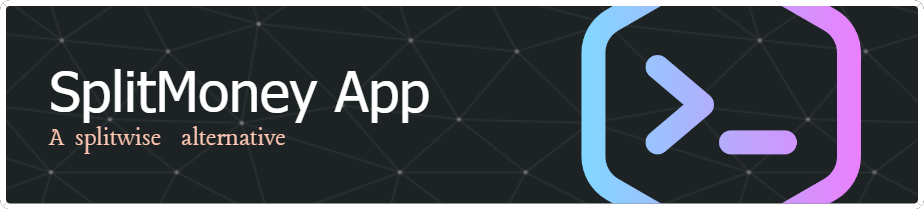
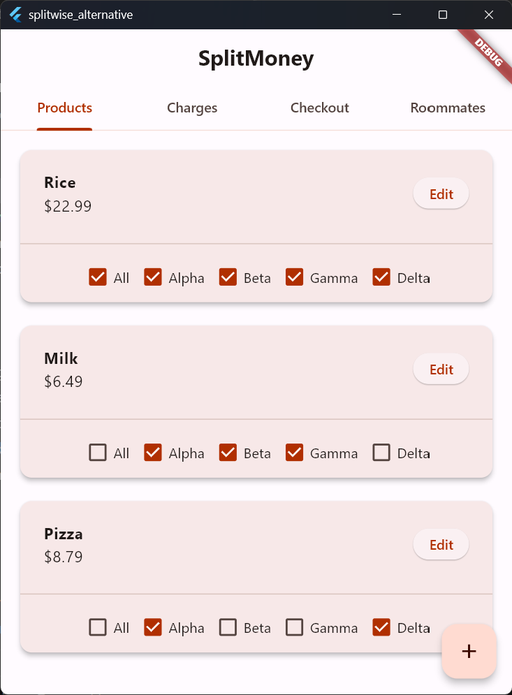
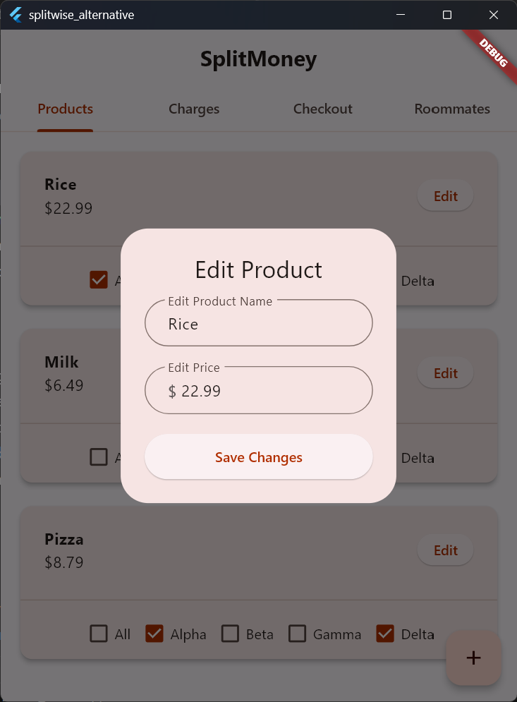
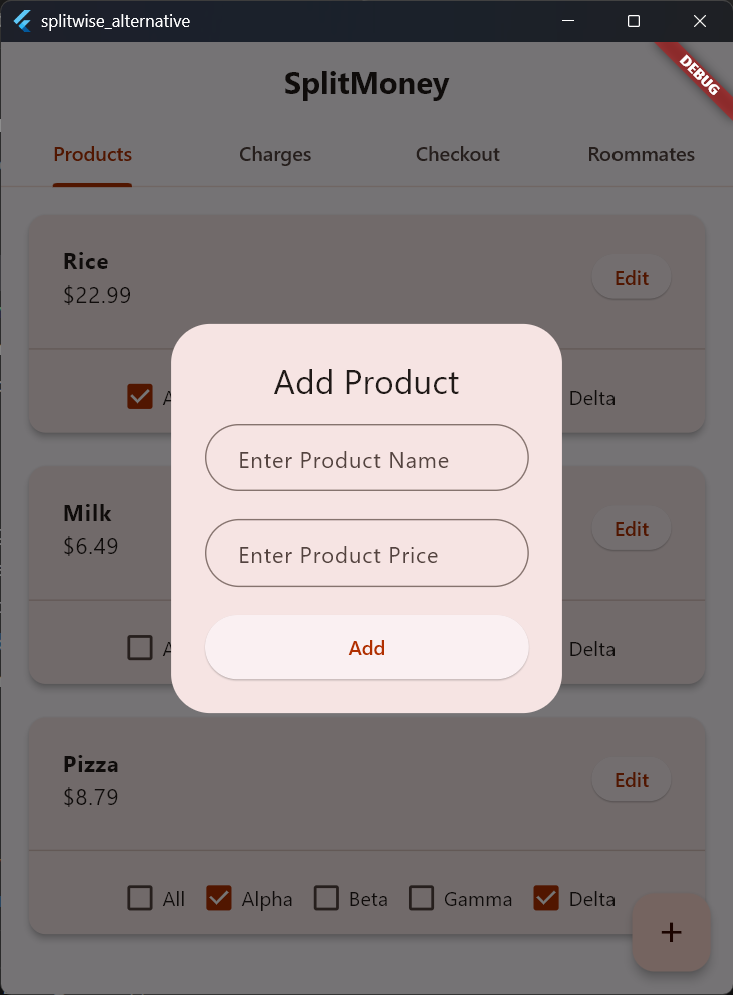
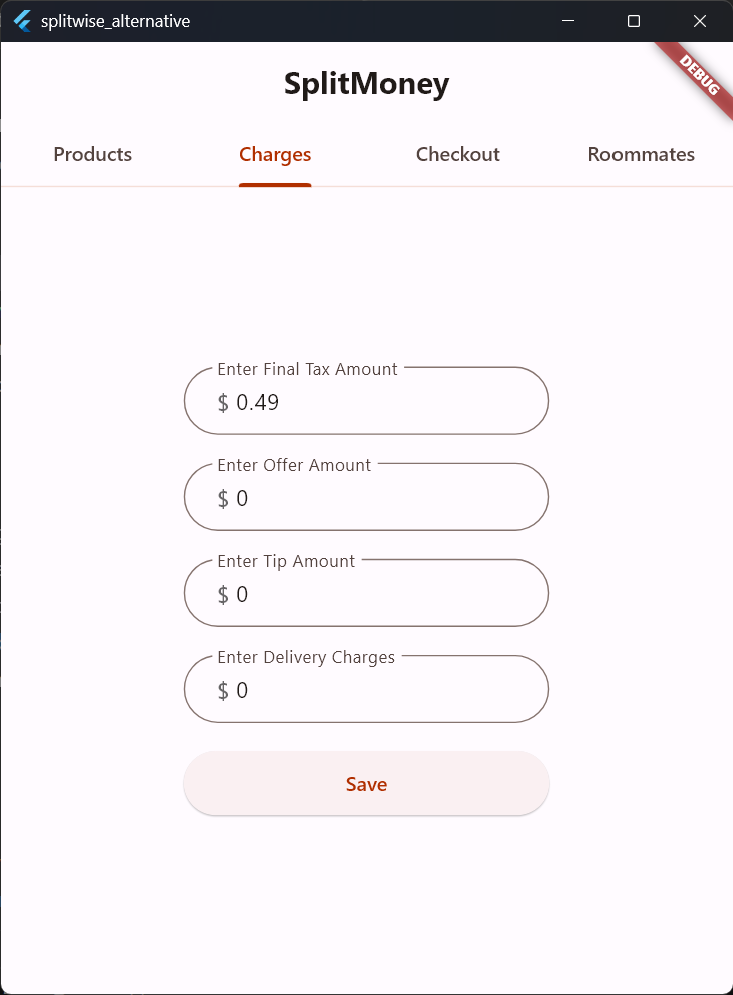
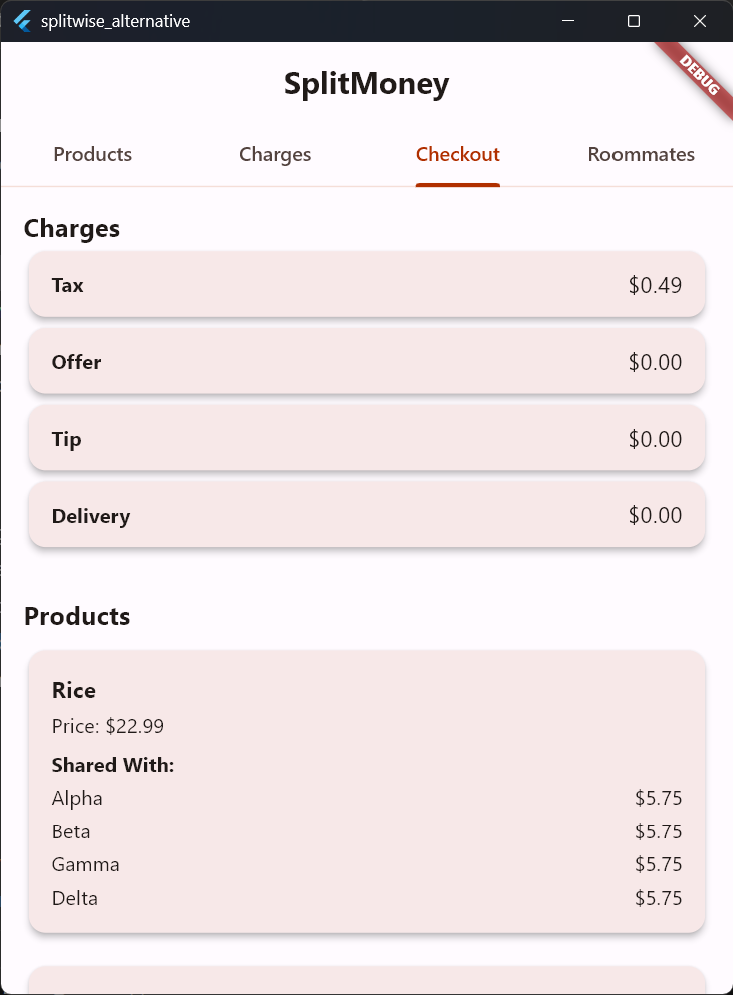
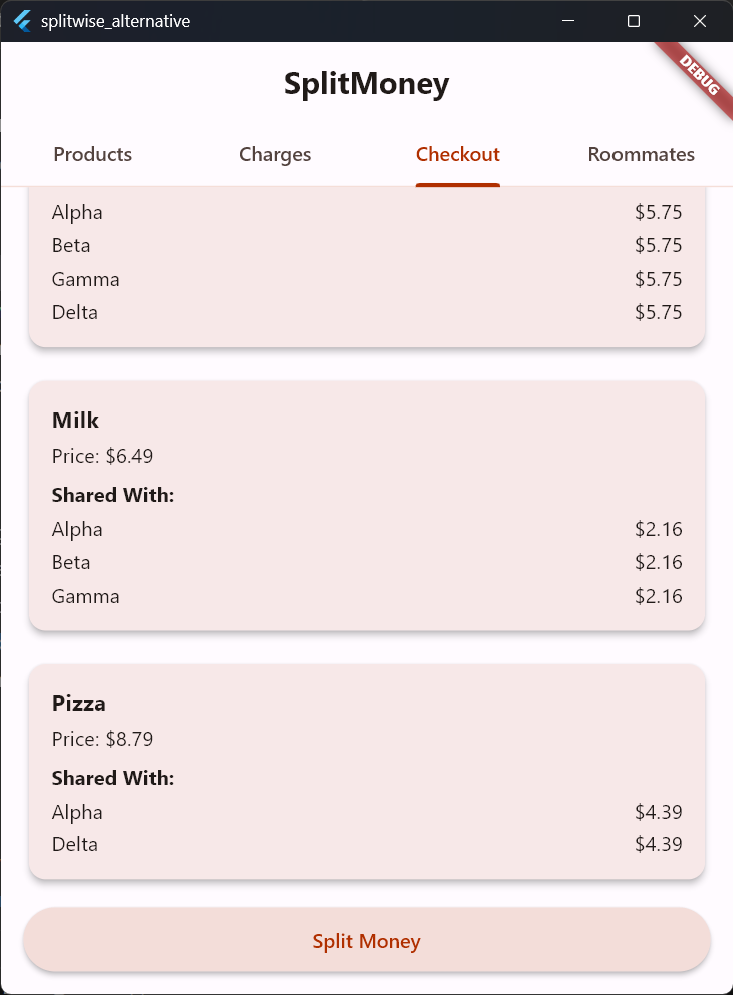
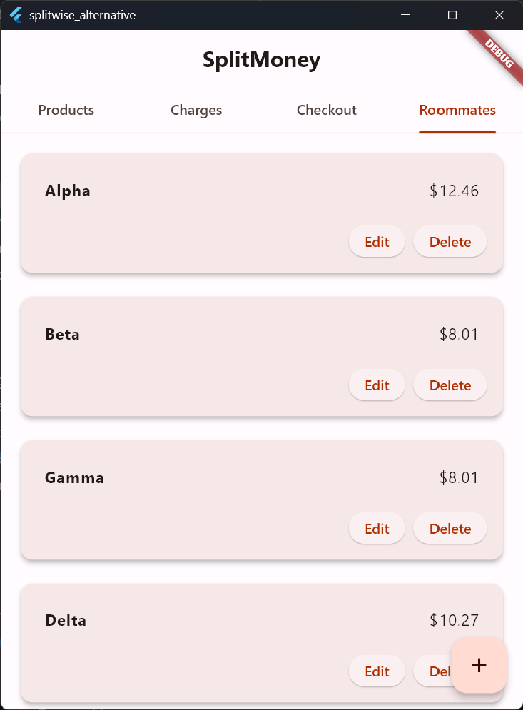
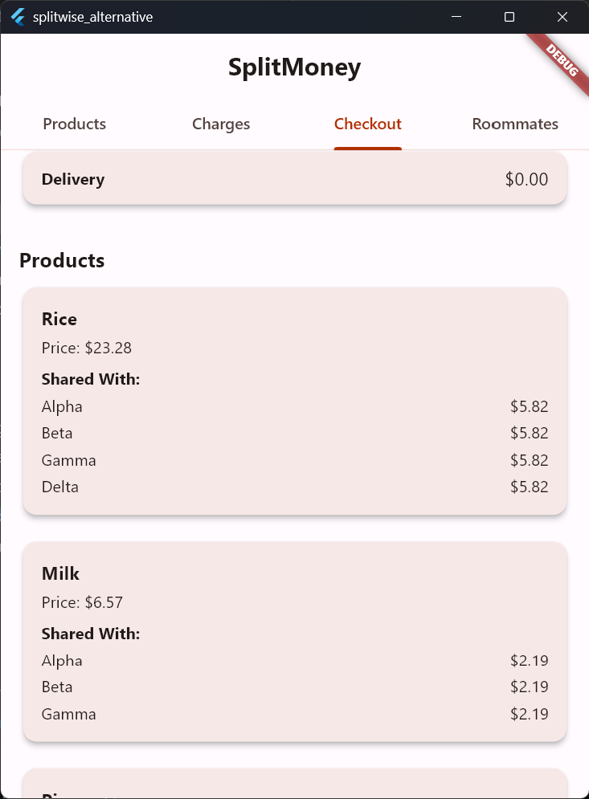

# SplitMoney App

### Overview
SplitMoney is an open-source, Flutter-powered application designed as a feature-rich alternative to Splitwise. While maintaining the simplicity of splitting bills, SplitMoney enhances functionality by including tax calculation—a feature often requested but unavailable in other similar apps.

Currently, APK and Windows versions are available for download and testing.

### Features
- Split Expenses: Easily divide expenses among groups or individuals.
- Charges Calculation: Automatically calculate and include charges like tax, delivery, tip, discounts in shared bills.
- Better UI: A modern, user-friendly interface designed for simplicity and ease of use.
- Cross-Platform Support: Works on Android and Windows.

### Usage
1. Add People
2. Add Products
3. Select people invovling for each product
4. Update charges like Tax, Delivery, Tip, Discount.
5. Have a view on the Checkout Form
6. Click to view the split money.

### Screenshots
 
 
 
 

### Contributing to SplitMoney
Any kind of positive contribution is welcome! Please help us grow by contributing to the project.

If you wish to contribute, you can:
- Create a Feature: Suggest and implement new features.
- Test the App: Help us identify and fix bugs.
- Improve the App: Optimize performance or enhance the user experience.
- Improve Documentation: Help clarify or expand the documentation.
- Spread the Word: Create content or tutorials about SplitMoney and share it with the world.
- Please read the CONTRIBUTING.md file for details on our Code of Conduct and the process for submitting pull requests.

### Acknowledgments
- Inspired by Splitwise for its utility and simplicity.
- Thanks to the open-source community for their valuable tools and resources.